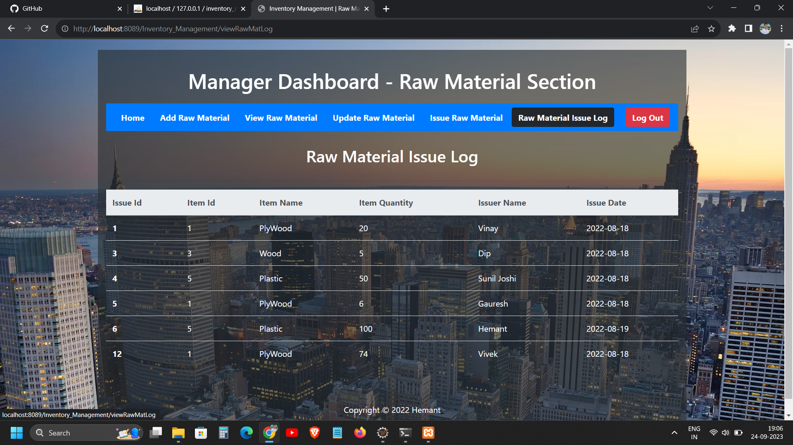

- Welcome to the Inventory Management System, a web application designed to help businesses keep track of their inventory.

# Features

- Spring MVC Architecture followed.
- Add: Add new raw materials and processed items to the inventory.
- Delete: Remove items from the inventory as needed.
- View: View the current inventory and details of each item.
- Update: Update the quantity and other details of items in the inventory.

# Here are some Screenshots

- Login Page

- Manager Home Page

- Add Raw Material

- Issue Raw Material from Stock

- Update stock of Raw Material

- Logs of Raw Material

- See understocked Raw Materials

# Usage

> Using the Inventory Management System is simple. You can add, delete, view, and update both raw materials and processed items in the inventory.

# Contributing

> We welcome contributions to the Inventory Management System. If you would like to contribute, please fork the repository and submit a pull request.
